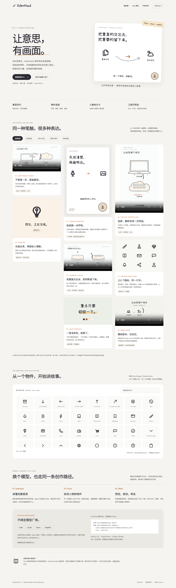

# VideoHand 3.3 · Icon First

**用物件的动作解释内容，让同一个故事接着发生。**

这是 VideoHand **3.3 源码升级版**。GitHub 源码可直接运行；本文不表示已发布 npm 包。使用白底、Oreo 原始涂鸦图标与原创 SVG 物件：Agent 先理解整段话，再决定让真人说、让图形解释，或让两者一起出现；HyperFrames 执行可复现的时间轴。无露脸 TTS 使用独立编写的 HTML 工程，当前录制口播 CLI 不直接接受纯音频。

[](https://github.com/derek-zhuolin/VideoHand/actions/workflows/ci.yml)
[](./LICENSE)


[竖屏预览图](examples/director/preview-portrait.png) · [瀑布流作品与图标墙](https://derek-zhuolin.github.io/VideoHand/) · [中文入口](README.zh-CN.md)

## 3.3：画面克制，动作讲清楚

一个主物件，最多两个辅助图形。人物以右下圆形小窗为主，关键句短暂居中时配合一个有意义的 Icon 动作。标题、主图和字幕分区清楚；手写字幕每句只划一个杏仁色关键词。去掉无语义用途的大纸张、底色椭圆和装饰曲线。

[观看 20 秒公开示例](https://derek-zhuolin.github.io/VideoHand/#icon-first-study)：同一个拼图接入两种工具，工具遇锁受阻，铅笔沿实际路径补出图片。公开版本使用手绘人物占位和通用字幕，无声且不含私人素材。

```bash
node examples/icon-first/build.mjs --out ../icon-first-study
hyperframes check ../icon-first-study --snapshots --json
hyperframes render ../icon-first-study -w 1 -o ../icon-first-study.mp4
```

这是可编辑的 HTML 创作示例，已有录制口播 CLI 保持兼容。它没有新增自动语义分析、自动避让或 `presentation.preset` 枚举。使用规则见 [Icon 优先口播构图](references/icon-first-composition.md)，动作与边界见 [示例说明](examples/icon-first/README.md)。

## 3.2：让物件行动，不让页面代替动作

这一版修正了“连续画面”的创作规则：连续性来自同一物件的状态、因果变化与跨段接力，不是让一张长页面不停上移，也不是给每个图标套相同的摆动。

- **动作有目的**：记录陆续出现、聚拢、遮去身份，再整理成笔记；每步都改变上一状态。
- **节奏有承接**：物件起步、加速、减速落位，错峰交接；相机和需要阅读的文字可以稳定。
- **先校对声音，再安排动作**：新增片头、重排段落、调整语速后，重新核对旁白、字幕与动作锚点。
- **验证口径更准确**：重复帧检测用于定位可能的停帧，不能证明 easing 自然或视频好看；新风格先看 10–15 秒小样。

[14 秒无声动作研究与构建说明](examples/motion-study/README.md) 提供可编辑 HTML，展示物件状态变化和接力。它没有私人语音或笔记，也不是 TTS 通用生成命令。详细创作约定见 [无露脸动作编排](references/continuous-noface.md)、[验收标准](references/quality.md) 和 [更新记录](CHANGELOG.md)。

## 保留的白底视觉与展示页



- **浮起的白色画布**：浅灰白外底、四周留白、轻圆角和柔和阴影。
- **圆形人像**：图解为主时放在角落，个人判断时主镜头填满内画布；字幕保留独立空间。
- **模型无绑定**：不同 Agent 共用计划与 CLI。[兼容边界和通用提示词](references/model-compatibility.md) 明确区分接口迁移与实际模型测试。
- **瀑布流展示页**：[看画面、动效与 152 个原始图标](https://derek-zhuolin.github.io/VideoHand/)，可筛选类型、搜索图标名称、播放中性示例。

新计划加入 `"presentation": {"preset": "framed"}` 即可使用这套视觉设置。旧计划保持原布局。

```bash
node bin/videohand.mjs compose --plan examples/director/framed-presenter.json --out ../framed-study
```

这个中性示例没有真人媒体，用于检查构图；接入自己的口播见下方流程。公开页面的人像位置用原创手绘角色表示。

## 连续画面怎么表达

同一批任务先堆进电脑，再移入云端；电脑恢复轻松，任务仍然是刚才那一批。团队协作也可以用同一种语法：把重复任务交给伙伴，把关键判断留在自己这边。

画面表达一句话背后的**意思和关系**。关键词只帮助定位动作或强调原话，不负责按词配图。流动感来自物件身份、因果过程和恰当停留，而不是每句话清空画面或持续堆叠动画。

| 无声视觉研究 | 可编辑计划 | 视频 |
| --- | --- | --- |
| 28 秒：容量与任务交接 | [capacity-handoff.json](examples/director/capacity-handoff.json) | [横屏](docs/assets/director/capacity-landscape.mp4) / [竖屏](docs/assets/director/capacity-portrait.mp4) |
| 18 秒：团队交接与保留判断 | [team-handoff.json](examples/director/team-handoff.json) | [横屏](docs/assets/director/team-landscape.mp4) |

这两支研究没有本人视频、录音或真实转录，文案是演示内容，不能作为真人口播或声画同步的黄金样例。合成影音测试只验证技术链路。本地已完成一份录制口播的竖屏样片检查；私人视频、原声与转录不公开。

[同内容新旧对照](examples/director/README.md)：旧 starter 与新连续场景使用相同标题、28 秒时长、字幕和字幕时间。可直接观看 [旧版](docs/assets/director/capacity-starter.mp4) / [新版](docs/assets/director/capacity-landscape.mp4)。

## 已实现与当前边界

| 已实现的工程能力 | 当前边界 |
| --- | --- |
| 导入录制视频，探测真实时长，读取 SRT/VTT/JSON 转录 | ASR 未内置；CLI 不会自行识别语义或生成转录 |
| Agent 写语义计划；CLI 校验并构建四种构图 | 语义判断依赖 Agent 通读全文和查看必要片段 |
| 分层电脑、云、托盘、任务与 Oreo 图标；连续累积和交接 | 当前动作是有限组件库，不是任意动画生成器 |
| 一个源视频保留原声；支持连续片段的起点和时长 | 不自动删除口误、拼接跳切、变速或混合多音轨 |
| 横竖屏分别定位，导出 HyperFrames 工程 | 每个画幅仍要独立做浏览器碰撞、裁切和字幕检查 |
| HTML 内局部修改标签、构图、动作时间并备份 | 不保证任意 Studio 编辑都能自动往返同步 |
| 独立 HTML 无露脸工作流与 14 秒动作研究 | `prepare/compose` 未内置纯音频输入、TTS 合成或任意物件变形 |

当前 PiP 角落由计划指定，默认右下；还没有自动找脸、抠像、人物跟踪或智能选择空白角落。实时摄像头、流式语义响应和直播不在本次范围。

## 让什么占据主画面

| 构图 | 使用依据 |
| --- | --- |
| `a` | 真人足以表达经历、态度、判断或总结 |
| `a-support` | 真人主导，一处小注释能帮助理解 |
| `b-pip` | 图形解释关系，真人的小窗仍提供表达价值 |
| `b` | 图形细节需要整个画面，或真人此时没有新增价值 |

Agent 为每段记录原话、核心意思、关系、视觉任务和选择理由。没有新的视觉需要就延续上一构图；没有固定 A/B-roll 比例或机械轮播。用户显式指定的构图优先。

## 从当前源码运行

需要 Node.js ≥ 22；媒体探测需要 ffprobe，影音制作需要 ffmpeg；预览、检查与渲染使用已安装的 HyperFrames。以下命令在当前仓库根目录执行，不依赖预览版已发布到包仓库。

```bash
node bin/videohand.mjs doctor
node bin/videohand.mjs icons arrow

node bin/videohand.mjs compose --plan examples/director/capacity-handoff.json --out ../capacity-study
node bin/videohand.mjs compose --plan examples/director/team-handoff.json --out ../team-handoff-study
```

输出目录必须位于仓库／已安装 Skill 之外，且尚不存在。在输出的具体画幅目录运行：

```bash
hyperframes preview
hyperframes check --snapshots --json
hyperframes render -w 1 -o renders/film.mp4
```

### 接入自己的口播

```bash
node bin/videohand.mjs prepare --video /path/to/recording.mp4 --transcript /path/to/captions.srt --out ../talk-brief
```

`--transcript` 可省略，但省略不会触发自动 ASR。导入后，Agent 阅读 `DIRECTOR-BRIEF.md`、`source.json` 与已有 `transcript.json`，通读全文并编写 `director-plan.json`。SRT/VTT 是句级字幕，不能伪装成词级时间。

给 Agent 的创作目标可以是：

> 用 VideoHand 为这段已录制口播编排画面。保留原话里的限定条件和事实；按完整意思分段，不逐条字幕切镜头。优先用简洁的物件关系解释难点，真人是否出现取决于这一段的表达价值。白底、Oreo 涂鸦风格，同一物件保持身份。先写清每段 meaning、reason 和 visual.task，再构建工程。

计划中 `source.path` 指向录制文件，`source.start` 为连续截取起点。所有段落、字幕与动作时间相对成片起点；截掉开头后需相应转换转录时间。

```bash
node bin/videohand.mjs compose --plan ../talk-brief/director-plan.json --out ../talk-film
node bin/videohand.mjs inspect --html ../talk-film/landscape/index.html
```

完整 schema、动作参数和媒体边界见 [离线导演工程](references/director.md)。

修正字幕、换物件、改品牌色以及新增组件的具体步骤见 [局部编辑与扩展](references/director-editing.md)。

### 无露脸 TTS 与动作小样

独立 TTS 片由作者将获授权的本地音频接入 HyperFrames HTML，并按实测音频时间编排字幕和物件动作。当前没有一条从任意文本自动生成该类成片的 CLI 命令；配音服务、音色授权与声画校对仍需单独处理。见 [音频接口](references/audio.md) 和 [无露脸动作编排](references/continuous-noface.md)。

公共无声研究可以独立构建，用于修改和观察动作：

```bash
node examples/motion-study/build.mjs --out ../motion-study
```

这段研究采用同一组对象的状态变化、短时 easing 和错峰接力；不以常驻品牌栏、图标墙或匀速长画布作为开场与衔接。新风格先渲染 10–15 秒并正常速度观看，再扩展全片。私人的 TTS 音频、原始笔记和语音配置不随公共研究发布。

### 修改已经生成的工程

每个画幅的 `index.html` 是后续编辑的权威来源；原始计划只用于首次生成，`DIRECTOR.md` 是当时的快照。不要反复 compose 来覆盖人工编辑。

`revise` 支持 `label`、`layout` 和动作 `timing`。例如，将下面内容保存为 `changes.json`，调整团队示例的一次交接：

```json
[
  {"type":"label","target":"partner","value":"协作伙伴"},
  {"type":"timing","target":"move-tasks","at":5.2,"duration":2.6}
]
```

```bash
node bin/videohand.mjs revise --html ../team-handoff-study/landscape/index.html --changes ./changes.json
node bin/videohand.mjs inspect --html ../team-handoff-study/landscape/index.html
```

修改前备份 HTML，修改后重新校验；其他人工 HTML/CSS 改动保留。横竖版分别修改和检查。更复杂的编辑直接在工程源码中进行，不宣称已具备完整的通用视频编辑器能力。

## 视觉来源与旧版兼容

- Director 默认白底 `#FFFFFF`、墨色 `#2B2A33`，辅以克制的强调色和浅色填充。
- 保留 [Oreo Design / Doodle Icons](https://github.com/oreo-design/doodle-icons) 的 152 个原始 SVG，路径仍在 `assets/doodle/icons/`，不重新粗糙化或混入其他图标库。
- 电脑、云、托盘和任务是 VideoHand 原创 SVG 扩展，沿用涂鸦轮廓与克制配色。它们与 Oreo 原图标分别登记来源，不冒称原图标库新增资产。
- 标题、字幕和正文使用随包字体；缺字会在构建时提示。图标、字体、GSAP 随工程复制，避免依赖私人路径。
- 16:9 为 1920×1080，9:16 为 1080×1920，横竖屏各自构图。

旧 `create` 暖纸 starter 保持兼容：

```bash
node bin/videohand.mjs create --config examples/doodle/project.json --out ../my-doodle-film
```

[旧横屏标尺](examples/doodle/landscape.png) / [旧竖屏标尺](examples/doodle/portrait.png) · [Doodle 来源参考](references/doodle-design.md) · [旧 HW 工程流程](references/legacy-workflow.md)。旧暖纸配色与卡片工程不是 Director Preview 的默认视觉。

## 验证与交付

```bash
npm test
npm run doctor
git diff --check
```

测试检查媒体时间、语义计划约束、任务身份与归属、构建和局部修改。它们不能替代观看成片。每个画幅还要检查实际运动、画面碰撞、PiP 遮挡、字幕可读性、最后一秒和声画同步。未接入真实口播或获授权 TTS 时，必须保留“无声视觉研究／技术测试”的状态，不把生成成功写成有声成片验收通过。

`python3 tools/check-frame-motion.py film.mp4` 默认生成停帧与变化量诊断，只有显式 `--max-freeze-seconds` 才启用技术阈值。重复帧可能是有意的阅读停留，非重复帧也可能只是背景漂移；两者都需要结合内容判断。这个工具不做审美评分，也不替代逐段旁白与动作对照。

本次实际结果见 [验证记录](references/validation.md)：包含通用视觉配置、独立安装构建、浏览器检查与本地私人样片的验证边界。

交付包含 MP4、可编辑工程、来源与许可、已完成的验证和仍未完成的部分。原始本人素材不默认提交或公开。更多参考：[验收标准](references/quality.md)、[音频](references/audio.md)、[安装与迁移](references/portability.md)。

## 欢迎点星，也欢迎定制开发

如果 VideoHand 帮你做出了片子，欢迎在 GitHub 上 [点 Star](https://github.com/derek-zhuolin/VideoHand)。也欢迎提交 Issue、Pull Request、风格参考与可复现的工程问题。

需要品牌风格、行业物件或自己的 Agent 工作流，可通过仓库 Issue 描述需求。

## 目录与许可

- [SKILL.md](SKILL.md)：给 Agent 的创作与交付约定。
- [references/director.md](references/director.md)：实际接口、schema、动作与限制。
- [examples/director/](examples/director/)：可复现的无声视觉研究。
- [examples/motion-study/](examples/motion-study/)：14 秒物件动作研究与独立 HTML 构建器。
- [examples/icon-first/](examples/icon-first/)：20 秒 Icon 优先口播构图与沿路径补画示例。
- [examples/doodle/](examples/doodle/)：兼容的 3.0 暖纸 starter。
- [THIRD-PARTY-NOTICES.md](THIRD-PARTY-NOTICES.md)：原始图标、字体、依赖与原创扩展来源。

VideoHand 源码采用 [MIT](LICENSE)；第三方图标、字体和依赖以各自许可证为准。版本号对应 GitHub 源码；第三方平台与 npm 的发布状态独立。

## 维护展示页

在源码仓库运行 `npm run showcase`，从 `templates/showcase.html` 和原始 Oreo SVG 生成 `docs/index.html`。公开视频与海报保存在 `docs/assets/director/`；不复制用户影片。`docs/legacy.html` 保留旧组件墙。页面本身无在线模型调用、账户登录或素材上传。
