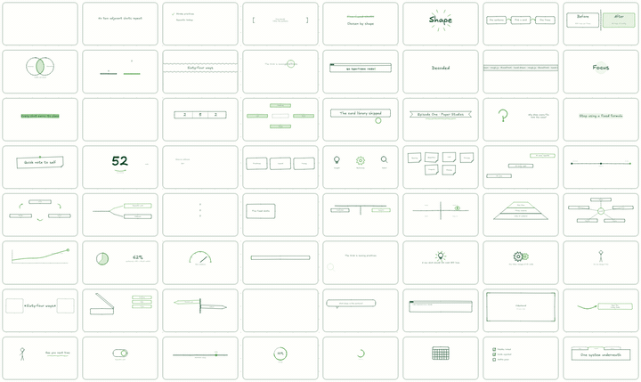

# VideoHand

[English](./README.md) | **中文**

**VideoHand 是一个 Agent 通用的手绘视频 Skill。**

给一段文字，出一支像随手画在纸上的小视频。

你不写代码，也不挑模板。跟你的 agent 说人话，它读这份 skill —— 逐句决定画什么、
怎么画、画完怎么验收，最后交一支 MP4。

[](https://github.com/derek-zhuolin/VideoHand/actions/workflows/ci.yml)
[](https://www.npmjs.com/package/videohand)
[](https://nodejs.org)
[](./LICENSE)

---

## 演示



↑ 这是 64 张里的 16 张。全部 64 张去**[在线 64 格墙](https://derek-zhuolin.github.io/VideoHand/)**
直接逛，不用装任何东西 —— 同时循环播，顶部可切 9:16 / 16:9 / 1:1 和中英文，
四个滑杆实时调笔触。

装完本地也有同一面墙：`npx github:derek-zhuolin/VideoHand playground`。

每一格跑的都是那张卡的**真实代码**，所以这面墙同时也是 64 张卡的冒烟测试：
哪张写错了，那一格会红着报错。

挑片子之前先来这儿逛一圈，比读文档快得多。

---

## 安装

```bash
npx github:derek-zhuolin/VideoHand
```

完事。**你需要预先装好的东西只有一样：[Node](https://nodejs.org) ≥ 22。**

> `npx` 认得 GitHub，所以这条命令直接从本仓库装，不经过 npm registry ——
> 你不需要 npm 账号，也不需要先会 git。

其余的都别担心：

| 东西 | 要不要你操心 |
|---|---|
| **HyperFrames**（渲染引擎） | **不用**。`npx` 现拉现用，不预装 |
| **rough.js / GSAP / 字体** | **不用**。都在包里，离线可用 |
| **git** | **不用** |
| **ffmpeg** | 只有**最后渲成 MP4** 那一步要。选卡、建帧、看效果都不需要 |
| 某家模型 / 某个 API key | **不用**。这个目录就是 skill 本身，不绑定任何一家 |

> 为什么 Node 要 22：渲染引擎 HyperFrames 自己声明了 `engines.node >=22`。
> Node 20 上这个 skill 装得上、自检也几乎全绿，但**一渲染就废** —— npx 会因为那条
> 约束直接拒装引擎，而报错长得像网络问题。所以下限跟着它走，宁可装之前就拦住你。

它会探测你本机装了哪些 agent（Claude Code / agents / Codex / Cursor / Crush /
Gemini / WorkBuddy），往每个**已经存在**的 skill 目录里装一份。没装的工具不去凭空
建目录 —— 那只会在你机器上留一堆你从没用过的空壳。

---

## 它适合做什么片子

- **观点片 / 论证片** —— 有转折、有对比、有「不是 X 是 Y」的那种
- **产品上新 / 功能讲解** —— 要说清「它是什么、能干什么、怎么用」
- **知识拆解 / 教程** —— 有流程、有步骤、有因果链
- **数据陈述** —— 有几个数字要让人记住

一句话判据：**你的稿子里有「形状」，它就有的画。**
「这三件事缺一不可」是个三角，「先这样再那样」是条流程，「不是 X 是 Y」是一次划掉重写。

不适合的：需要真人出镜、需要实拍素材、需要精确复刻某个品牌视觉规范的片子。

---

## 工作原理

```
你的一段文字
  ↓
逐句读，判断每句话「是什么形状」
  ↓
从 64 张画面卡里挑（相邻不许重样、高能镜头不许扎堆）
  ↓
用笔画原语建帧（不是套模板，是现画）
  ↓
五道闸逐个验收（跑不过就不给渲）
  ↓
MP4
```

### 一、逐句选卡，不套模板

做内容的人都撞过同一堵墙：第一支挺好，第十支跟第一支长得一模一样。

问题不在审美，在结构。市面上的工具给你一个模板，你往里填字 —— **模板不认识你的内容**，
所以十支片子共用一副骨架，观众三秒就认出「又是这个」。

可真正会讲的人是怎么做的？他说到「这三件事缺一不可」，手会在空中比一个三角；
说到「先这样，再那样」，手会往前推三下。**画面是从句子的形状里长出来的。**

这个 skill 把那个本能拆成了 64 张画面卡，逐句去挑：

| 你的句子 | 它挑的画面 |
|---|---|
| 「A 变成 B 变成 C」 | 流程箭头 |
| 「这三个只能选两个」 | 不可能三角 |
| 「不是 X，是 Y」 | 划掉，重写 |
| 「说到底就一句话」 | 大字砸下来 |
| 「这事儿有四个原因」 | 鱼骨图 |

开场和落版各锁一张，中间几镜完全跟着句子走。还有硬规则拦着：相邻不许重样、
高能镜头不许扎堆、必须留一张让观众喘气的。

**于是决定画面的是你的稿子，不是模板。**

### 二、画面是算出来的，不是滤镜贴的

为什么偏偏是手绘？因为手绘看起来像**在想**，不像在卖。

线条抖、方框四个角对不齐、下划线是歪的波浪 —— 这些「不完美」在替你说一句话：
这是有人一边想一边画给你看的。观众对这种东西防备心最低。反倒是精致的模板动画，
每一帧都在提醒对方「你正在看一支广告」。

所以抖动不是滤镜：底座用 [rough.js](https://roughjs.com)（Excalidraw 自己那套手绘
渲染引擎），字体沿用 Excalidraw 的官方搭配（Excalifont + 小赖字体）。
**同一句话每次渲染抖在同一个地方**，因为随机数带种子。

画面也不是手写三百行代码画出来的，而是 65 个**确定性笔画原语**（抖动方框、弧线箭头、
涂鸦填充、火柴人、齿轮…）加 8 套版面槽位拼出来的。所以加一种新画面 ≈ 30 行配置。

### 三、五道闸拦在渲染前面

这类片子翻车从来不翻在创意上，翻在细节上。每一道闸都是真出过一次事才写进去的 ——
详见下面的[质量检查](#质量检查)。

---

## 快速开始

装完之后，跟你的 agent 说人话就行：

> **把这段话做成手绘视频：**
> 我们做了个命令行工具，把一堆截图拼成一张联系表。它干三件事：自动排版、
> 自动压缩、自动生成索引。装上就能用，一行命令。

它会读 `SKILL.md`，逐句选卡、建帧、跑五道闸，然后渲染。你不用懂卡名，也不用写配置。

想让它照你的意思走，就在稿子后面加一句大白话 —— 这些它都听得懂：

> …**开场别太用力**，中间那句「三选二」要重点画出来，结尾放我的名字，
> **做成竖屏**，不要配音。

**中文标题最好自己断行。** 机器断行是能看的兜底，但你知道词在哪儿断最好看：

```
标题写成 ["直接推出去", "速度不允许精致维护"]
比写成 "直接推出去速度不允许精致维护" 好
```

---

## Agent 会替你判断什么

- **每句话该配哪张卡** —— 按语义查 `references/scenes-index.md`，不是随机抽
- **相邻两格不许重样** —— 同一支片里不出现两个一样的镜头
- **能量怎么分配** —— 高能镜头不扎堆，中间必须留一张让人喘气的
- **转场怎么配** —— 上一格怎么出，决定下一格怎么进
- **文字往哪儿放** —— 安全区、三层版面、主体重心，都有硬约束
- **中文在哪儿断行** —— 标点优先、末行至少两个字，不许出孤字
- **配色够不够看清** —— 对比度不到 3:1 的组合直接不给用

---

## 交付内容

跑完你会拿到一个完整的工程目录，而不只是一个视频文件：

- **MP4 成片** —— 9:16 / 16:9 / 1:1 三种画幅自适应
- **可改的工程** —— 每一格是一个独立 HTML，想调哪格改哪格，不用整片重来
- **STORYBOARD.md** —— 这支片为什么这么选卡，逐格写着
- **自带的 `assets/`** —— 引擎随片走，换台机器也能重渲
- **可选：配音 + 词级手绘字幕** —— 配音契约不绑定任何 TTS 厂商

---

## 质量检查

五道闸，**都得退出码 0 才给渲**：

```bash
node scripts/portability-lint.mjs <片目录>  # 跨平台：合成之后才发作的那一类
npm run check                              # HyperFrames：渲染错误 + 对比度 + Runtime
node scripts/scene-lint.mjs  <片目录>       # 选卡纪律：相邻不重、能量配比、转场种类
node scripts/motion-lint.mjs <片目录>       # 动效尺度：时长、错峰、缓动词表
node tools/gate.mjs . --stage 2 --spans <每格秒数> --captions 1   # 画面审计
```

它们看的是**互不重叠的四个层**：

- **portability-lint** 看合成之后的结构。这道闸是一次真实事故换来的：单帧预览全对、
  动图墙全对、其余四道闸全绿，**渲出来的片子一条手绘笔画都没有**。原因是帧里的 CSS
  选择器跟根的真实 id 对不上，`--hw-ink` 落空，`stroke: var(--hw-ink)` 解析失败、
  描边变成 `none` —— 形状一直好好地在 DOM 里，只是全透明。
- **check 的 Runtime 段**看浏览器真的报没报错。建帧脚本抛一个异常，那一格在成片里
  就是一整段纯白，而只读源码的闸一个都看不见。**别只看总退出码。**
- **scene-lint / motion-lint** 只读代码和 STORYBOARD —— 它们看不见画面。
- **gate** 抓帧判像素。真正让人一眼说「这不对」的几件事只有它查得出来：坠底、
  缝里空帧、字幕带空着、留白断层。

它替你盯着的具体几条：

- **中文断行不许出孤字。** 浏览器不知道「正反馈」是一个词，会把标题断成「…的正反 / 馈」。
- **字不许压字。** 文字真实高度取决于字体渲染，人在写坐标时算不出来，交给自检去量。
- **主体不许坠底、不许出安全区。** 竖屏下面 14% 是抖音小红书的按钮区，谁也不许进。
- **不许拿占位符充数。** 灰条和空心圆在任何结构里都读作「没做完」。

> 判闸一律看退出码，**不许 `命令 | tail -N`** —— 那拿到的是 tail 的 0，永远是「过」。

**顺序很重要：验收要排在渲染前面。** `hyperframes snapshot` 吃的是工程目录不是视频，
建完帧就能抓图，不必先渲。把顺序倒过来，发现问题的时间从 20+ 分钟掉到 2–5 分钟。

---

## 这个 Skill 是怎么组织的

如果你也在写 Agent Skill，这一节比上面那些更有用。

Skill 的核心约束是：**context window 是公共资源。** 你的 skill 跟 system prompt、
对话历史、其他 skill 的 metadata 挤在同一个空间里。所以真正的设计问题不是
「我知道多少」，而是「**什么时候才让 Claude 知道**」。

这个 skill 按三层加载：

| 层 | 是什么 | 什么时候进 context | 代价 |
|---|---|---|---|
| **1 · metadata** | `SKILL.md` 的 `name` + `description` | 永远在 | ~100 tokens |
| **2 · 指令** | `SKILL.md` 正文（289 行） | 用户提到手绘视频时 | < 5k tokens |
| **3 · 参考与脚本** | `references/*.md`、`assets/hw-cards.js`、五个 lint 脚本 | **只在真的走到那一步时** | 按需 |

所以 `SKILL.md` 里没有目录树 —— 有的是一张
**「你正要做什么 → 读哪个文件」**的导航表。选卡才读 `scenes-index.md`，
配音才读 `voice-pipeline.md`，出了怪事才读 `pitfalls.md`。不该在开头就把 40 条坑
全塞进去。

**脚本被执行时，代码本身不进 context** —— 只有输出消耗 tokens。所以五道闸可以写得
很厚（`hw-cards.js` 光 64 张卡就上千行），却不占 Claude 的预算。这也是为什么
"选卡纪律"这种确定性判断交给 `scene-lint.mjs` 而不是写成一段让 Claude 自觉遵守的话。

### 自由度是按脆弱性给的

不是所有地方都该给同样具体的指令。判据是**这一步错了会不会很贵**：

| 自由度 | 用在哪 | 指令长什么样 |
|---|---|---|
| **高** | 选哪张卡、文案怎么写 | 给方向和判据（「这句话是什么形状？」），不给答案 |
| **中** | 版面、转场、字幕 | 给硬约束 + 默认值（重心 30%–58%、一条字幕 ≤14 字） |
| **低** | 建帧的四条红线 | **精确到不许改**：根选择器只能是 `#root`，脚本必须引在 `<template>` 内 |

低自由度那四条为什么这么死板：它们**只在子合成被合进主合成之后才发作**，
单帧预览和动图墙永远是对的。翻过一次车 —— 整支片手绘笔画全灭、七帧叠成一坨、
两帧直接空白，**而当时四道闸全绿**。这种地方就是悬崖边的窄桥，只有一条安全路线。

### 用评估驱动，不是靠想象

`evals/` 里有三个场景（产品上新 / 观点片 / 教程拆解），每个都写明了
`expected_behavior`。改 skill 之前先跑一遍建立基线，改完再跑一遍对比。

原因很实在：**视频 skill 的失败方式，单元测试一个都抓不到。** 一支片可以渲得
干干净净，同时镜头重复、跑偏画风、拿灰条占位符充数 —— 代码全对，片子不能看。

---

## 画面卡库

九个族 54 张 + 附加族 10 张 = 64 张：

| 族 | 数量 | 什么时候用 |
|---|---|---|
| A 开场 | 6 | 片头。必选一张 |
| B 断言 | 5 | 一个数字、一句金句、一次纠偏 |
| C 列举 | 6 | 清单、便签墙、并列概念 |
| D 流程 | 7 | 变化、递进、时间线、循环、分岔、漏斗 |
| E 对比 | 8 | A vs B、前后、天平、维恩、象限、金字塔、辐射 |
| F 数据 | 7 | 柱、折线、饼、仪表、进度、滑杆、环 |
| G 隐喻 | 8 | 放大镜、灯泡、齿轮、火柴人、开门、拆盒、路标、等待 |
| H 界面 | 4 | 窗口、对话、终端、标签页 |
| I 落版 | 3 | 片尾。必选一张 |
| 附加族 | 10 | 揭示 / 文字动效 / 连续 / 变换 / 强调 / 数字。不占选卡配额 |

语义查表在 `references/scenes-index.md`。**卡的代码是唯一真源** —— 查到卡名就去
`assets/hw-cards.js` 搜它，抄 `build` 函数改文案。

---

## 版面与画风

竖屏 1080×1920 从上到下切三层，**互不重叠**：

| 层 | 位置 | 谁的地盘 |
|---|---|---|
| `S.safe` | 4% – 74% | 内容 |
| `S.caption` | 75% – 86% | 字幕带，只归 `HW.captions` |
| 平台 UI | 86% – 100% | 抖音 / 小红书的作者名、话题、按钮，谁也不许进 |

两条硬约束，都是实测翻车换来的：**主体重心必须落在 30%–58%**（safe 只说别出界，
不说别坠底），**safe 里不许有超过 25% 的连续空带**（不然画面从中间断成两截）。

| | |
|---|---|
| 纸面 | `#FFFFFC` + 26px 点阵 |
| 墨线 | `#003E1F` 深绿 |
| 强调 | `#53A548` 马克笔绿 —— **只做笔画**，写字用 `#3C7A33` |
| 字体 | Excalifont（拉丁）+ 小赖字体（中文，按本片字符重新子集化） |

颜色只写在**一处 token 块**里，改色不用碰 64 张卡。为什么马克笔绿只能画线不能写字
（在纸上只有 2.75:1，过不了 3:1 的对比度闸），记在 `references/palette.md`。

---

## 另外两条安装路径

想跟着仓库走、随时能 `git pull` 和改代码：

```bash
git clone https://github.com/derek-zhuolin/VideoHand.git ~/.claude/skills/videohand
node ~/.claude/skills/videohand/tools/doctor.mjs
```

或者让脚本替你探测 agent 目录再 clone（等价于上面那条 npx，只是走 git）：

```bash
curl -fsSL https://raw.githubusercontent.com/derek-zhuolin/VideoHand/main/tools/install.sh | bash
```

三条路装出来的东西一样。**只想用它选 npx，想改它选 git clone。**

### 从 handdrawn 升级过来

这个 skill 以前叫 `handdrawn`，现在跟仓库名统一成了 `videohand`，
斜杠命令也从 `/handdrawn` 变成 `/videohand`。重跑一次安装即可：

```bash
npx github:derek-zhuolin/VideoHand      # 它会自己认出旧目录
```

- 旧目录是**干净的 git 仓库** → 直接改名搬过去，无损。
- 旧目录**说不清里面有没有你的改动**（有未提交的东西，或者压根不是仓库）→
  **一个字节都不动**，只提醒你。确认没用了自己 `rm -rf` 再重跑。

第二条是有意做保守的：搬完紧接着就是覆盖写，判错一次就是**静默的数据丢失**。
裸目录的麻烦在于它看起来"很干净"，只是因为它根本没法说自己脏。

---

## 装不上的时候

先跑自检。它把"跑不起来"拆成几种不同的原因，每条都带一句能直接粘贴的命令：

```bash
npx github:derek-zhuolin/VideoHand doctor
```

查这六件事：Node 版本、ffmpeg、skill 的件是否齐、**中文字体是不是被截成了指针**
（1.4 MB 的字体常在传输中变成几十字节，症状是**片子照出，但中文全部掉回系统宋体**
—— 不盯着成片看根本发现不了）、npx 拉不拉得到 hyperframes、以及**你装的位置
agent 认不认**。

### 怎么知道自己旧了

装完就跟上游断了联系 —— 上游修了一个「要渲一支片才看得见」的 bug，你那份不会自己知道。
所以每次跑完会顺手比一下 npm 上的版本，落后就提醒你。

这个检查被刻意做得很怂：**异步不阻塞、1.5 秒超时、查不到就当没这回事、结果缓存 24
小时**。断网、内网、registry 不通都不会让它失败或变慢。嫌烦就
`export VIDEOHAND_NO_UPDATE_CHECK=1` 彻底关掉。

在这个包发上 npm 之前它查不到，就一声不吭（宁可不提醒，也不要瞎提醒）。
那之前想拉最新的，**重跑一次安装命令就是更新** —— npx 每次都去 GitHub 取当前的 main。

### 改了代码之后：一条命令全机对齐

维护者（或任何 git clone 装的人）commit 之后不用记得 push、也不用挨个目录 pull：

```bash
npx videohand sync                  # 领先就推、落后就拉、分叉就报，全机副本对齐
npx videohand sync --install-hook   # 装一次，从此 commit 完自动 sync
```

sync 只走 fast-forward：分叉了不猜不合，报出来让人决定 —— 自动 merge 出错的代价
是「渲一支片才看得见」。有未提交改动的副本一律不动。断网时 hook 静默放行，
不拦 commit，下次 sync 补上。

### 漂移这件事，别指望自己发现

"坏了就删"防不住 —— **因为你看不出它坏了**。实测过一次：同一台机器上有两份
videohand，目录结构、文件名、大部分内容一模一样，只有一份带着已经修好的 bug。
差别要**渲一支片出来**才看得见。

所以规矩不是"发现坏了就删"，是**让每一份都必须能自证版本**：

| 规矩 | 谁来查 |
|---|---|
| 每一份都得能说出自己是哪版（git 仓库，或带安装戳） | `doctor` 的副本盘点 |
| 每支片带的 `assets/` 必须跟 skill 那份逐字节一致 | `portability-lint` 第四条 |

第二条尤其容易中招：建片时会把 `assets/` 复制进片目录，**改完 skill 的引擎不同步过去，
重渲毫无变化**。人会以为"没修好"，回头去改本来已经对的代码。

> 顺带一提：这条规矩的落点是**能不能自证版本**，不是"必须是 git"。git 只是当时唯一
> 趁手的实现。`npx` 装出来的是复制体，但它带一份 `.videohand-install.json`
> （版本 + 引擎 + 来源 + 时间），一样张得开嘴，所以一样算数。
> 真正判 ✗ 的只剩第三种：既不是仓库、也没有戳的裸拷贝。

---

## 目录

```
videohand/
├── SKILL.md                    # agent 读这个
├── README.md                   # 英文版
├── README.zh-CN.md             # 你在读的这个
├── assets/
│   ├── hw-kit.js               # 引擎：笔画原语 + 槽位 + 编排器 + 审计 + 字幕
│   ├── hw-cards.js             # 64 张卡的 build 函数（唯一真源）
│   ├── hw-trans.js             # 转场的两半（盖上 / 揭开），每帧两行调用
│   ├── fonts/                  # Excalifont + 小赖子集
│   └── vendor/                 # rough.js + gsap
├── references/
│   ├── scenes-index.md         # ← 选卡从这里查
│   ├── layout.md               # 安全区 / 画幅自适应 / 槽位 / 入框契约
│   ├── palette.md              # 配色与对比度算账、字体子集化
│   ├── transitions.md          # 8 种手绘转场
│   ├── pitfalls.md             # 坑位全录（40 条实测）
│   └── voice-pipeline.md       # 配音契约（不绑定任何 TTS 厂商）
├── scripts/                    # portability-lint / scene-lint / motion-lint / build-gallery
├── tools/                      # install.sh / doctor.mjs / update-check.mjs / gate.mjs / frame-audit.py
├── bin/videohand.mjs           # npx 的入口
├── package.json                # npm 包（files 白名单，生成物不进包）
├── templates/                  # 帧脚手架 + 字幕皮肤
├── playground/index.html       # 64 格动图墙（生成物，不进包）
├── docs/                       # GitHub Pages：在线墙 + 每卡静帧 + wall.gif（产物入库）
└── evals/                      # 3 个评估场景，改 skill 之后跑它
```

**不绑定任何一家模型** —— 整个目录就是 skill 本身。实测同一份 `SKILL.md` 换模型跑，
闸和字幕契约都能准确复述。DeepSeek / GLM / Kimi 这类一般是把 harness 指到别的 API
端点，skill 目录不变，装一次就够了。

---

## 改这个 skill 的话

先跑 `evals/` 里的三个场景建立基线，改完再跑一遍对比。视频 skill 的失败方式
（镜头重复、跑偏画风、拿占位符充数）单元测试抓不到，只能靠场景评估。

要加一张新卡：在 `assets/hw-cards.js` 里加一条（照抄邻居的结构），在
`references/scenes-index.md` 的表里加一行，跑 `node scripts/build-gallery.mjs`，
打开动图墙看那格红不红。

每次 push，CI 都会在全新的 Ubuntu 和 macOS 上做两件事
（[看运行记录](https://github.com/derek-zhuolin/VideoHand/actions)）：

- **把 64 张卡中英文各真跑一轮** —— 所以主干上的卡是活的
- **当一个什么都没装的陌生人，照 README 第一条命令装一遍** —— 所以那条命令是活的

---

## 出问题了，或者想要点什么

直接开 [issue](https://github.com/derek-zhuolin/VideoHand/issues/new/choose)，
不用懂代码。三个模板对应三种情况：

| 你遇到的 | 开哪个 |
|---|---|
| 成片里字挤在一起、断行断错、画面重叠 | **出片效果不对** —— 拖张截图 + 贴上原文 |
| 有句话在 64 张卡里找不到对应形状 | **想要一张新画面卡** —— 说清楚那句话「是什么形状」 |
| 装完 agent 不认，或者跑起来报错 | **装不上** —— 贴路径和报错 |

报「出片效果不对」时，**截图和原文最有用**。中文的断行、字宽问题跟具体句子强相关，
没有原文很难复现。如果控制台里有 `[hw-audit]` 开头的行，一并贴上 —— 那说明自检已经
抓到了，能直接定位。

---

## 致谢

- [rough.js](https://roughjs.com) — MIT，手绘渲染引擎
- [Excalidraw](https://excalidraw.com) — MIT，字体与画风底座
- [wired-elements](https://github.com/rough-stuff/wired-elements) — MIT © Preet Shihn，
  7 张 UI 组件卡的绘制配方来源

## License

[MIT](./LICENSE)
